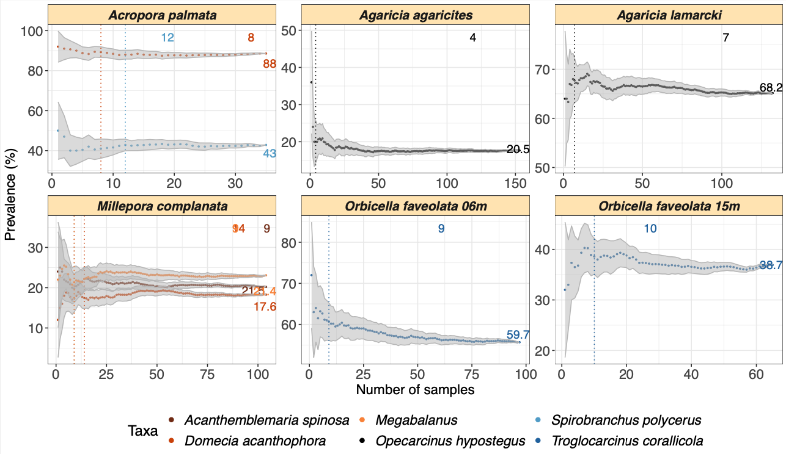

# SAMPLE: 

A DESCRIPTION

## Install

``` r
install.packages("devtools")
devtools::install_github("yacinebenchehida/SAMPLE/Package")
```

## Dependencies

-   R (\>= 4.3.0)

SAMPLES requires: `ggplot2`, `dplyr`, `Rmisc`,`RColorBrewer`.

## Functions

-   `rm_axis()` to remove either axis completely
-   `rm_strips()` to remove strips and labels from facets (when using `facet_wrap()` or `facet_grid()`)

## Example usage

``` r
library(ggplot2)
library(dplyr)
library(Rmisc)
library(RColorBrewer)

.....
```

## Output

blabla



