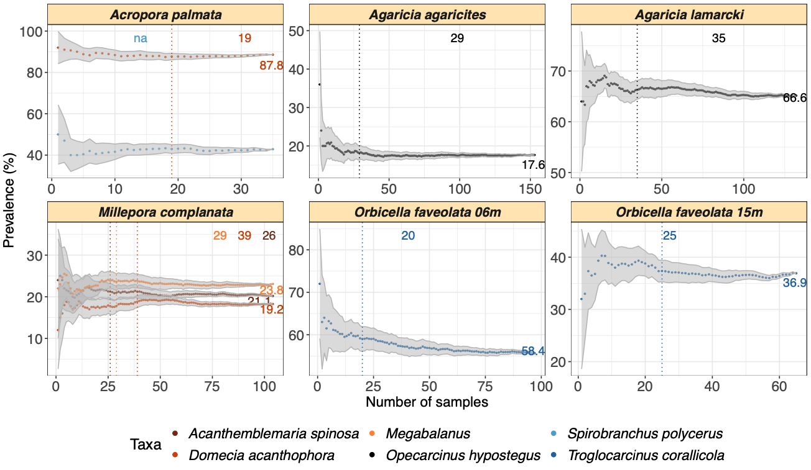

# SAMPLE: 

A DESCRIPTION

## Install

``` r
library("devtools")
devtools::install_github("yacinebenchehida/SAMPLE/Package")
```

## Dependencies

-   R (\>= 4.3.0)

SAMPLES requires: `ggplot2`, `dplyr`, `Rmisc`,`RColorBrewer`.

## Example usage

``` r
library(ggplot2)
library(dplyr)
library(Rmisc)
library(RColorBrewer)

.....

## Output

blabla



