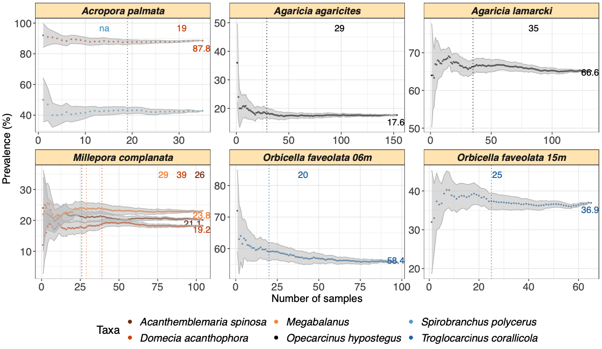

# SAMPLE: 

A DESCRIPTION

## Install

``` r
library("devtools")
devtools::install_github("yacinebenchehida/SAMPLE/Package")
```

## Dependencies

-   R (\>= 4.3.0)

SAMPLES requires: `ggplot2`, `dplyr`, `Rmisc`,`RColorBrewer`, `magrittr`.

## Example usage
### Run the full pipeline
``` r
library(SAMPLE)
data("coral_symbionts")
set.seeds(812)
SAMPLE(input = coral_symbionts,output_N = "Example",replicates = 50,stability_thresh = 2,sucess_points = 10,diff = 1)
```

### Output
The pipeline generates two types of files:
- A pdf showing the how the prevalence change as the sampling increases



EXPLANATIONS

- A text file showing for each host species and each taxa the sample size at which the prevalence becomes stable.

```
Host_species             Taxa                        Prevalence        thres_stability
Agaricia agaricites      Opecarcinus hypostegus      20.5              4
Agaricia lamarcki        Opecarcinus hypostegus      68.1818181818182  7
Acropora palmata         Domecia acanthophora        88                8
Acropora palmata         Spirobranchus polycerus     43                12
Millepora complanata     Domecia acanthophora        17.5555555555556  14
Millepora complanata     Acanthemblemaria spinosa    21.5384615384616  9
Millepora complanata     Megabalanus stultus         21.3846153846154  9
Orbicella faveolata_06m  Troglocarcinus corallicola  59.6923076923077  9
Orbicella faveolata_15m  Troglocarcinus corallicola  38.7142857142857  10
```
